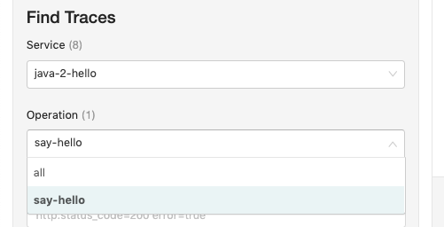
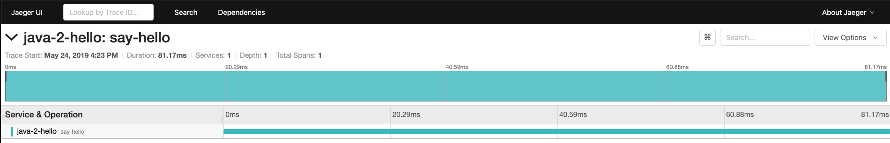
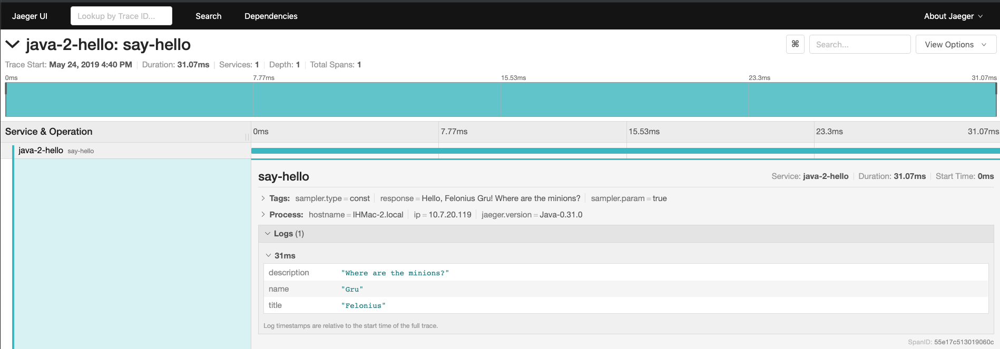

## Exercise 2 : The First Trace

이제 샘플 애플리케이션과 익숙해졌으니 가장 기본적인 Trace를 아래와 같이 3단계로 진행한다. 

 1. [`Tracer` 인스터스 생성](#step-1--tracer-인스턴스-생성)
 2. [HTTP handler에서 `Span` start](#step-2--span-start)
 3. [코드내에서 추가적인 정보를 `Span`에 추가](#step-3--코드내에서-추가적인-정보를-Span에-추가)


 ### Step 1 : `Tracer` 인스턴스 생성

OpenTracing은 API를 정의해 놓은 Spec이며, Tracing을 위해서는 실제 Tracer의 인스턴스를 추가해야 한다. 이번 예제에서는 Jaeger tracer를 사용할 것이며, OpenTracing-compatable한 다른 tracer(ex Zipkin tracer)로 대체해도 무방하다.  

Tracer는 주로 singleton으로 사용되면 애플리케이션 하나다 하나의 tracer를 사용한다. (그러나 Service Mesh와 같은 경우는 여러개의 tracer가 필요하기도 한다.) tracer의 구현은 개발언어와 framework 별로 서로 다르게 구현되어 있다. OpenTracing API 라이브러리는 global variable를 이용해서 global tracer를 정의하는 메커니즘을 제공하지만 dependency injection를 통해서 정의할 수도 있다. 

프로그래밍 언어별로 제공되는 Jaeger Library(Go, Java, Node.js, Python, C++, C#)는 Configuration Class가 제공되어 Tracer의 Builder역할을 한다. 이 builder는 `Production-ready"한 tracer를 기본적으로 제공하며, 1000번에 1번꼴로 sampling을 하도록 되어 있다. 그러나 예제에서는 Request가 적어서 모든 trace를 sampling할것 이기 때문에 Configuration Class를 "const"로 파라메터를 "param=1"로 설정한다.  
***Type of sampler (remote (default), ratelimiting, probabilistic, const)***  
참조 : https://github.com/jaegertracing/jaeger-client-java/blob/master/jaeger-core/src/main/java/io/jaegertracing/Configuration.java

>그리고 Jaeger BackEnd에서 Service Instance를 구별하기 위해서 **Server Name**을 제공해야 하는데 이 예제에서는 **"java-2-hello"** 라고 이름지었다.
> {language}-{exercise number}-{microservice name}

```java
// Tracer를 Bean으로 설정, Dependency Injection으로 Tracer를 사용 가능
// HelloApp.java
import org.springframework.context.annotation.Bean;

import io.jaegertracing.Configuration;
import io.jaegertracing.Configuration.ReporterConfiguration;
import io.jaegertracing.Configuration.SamplerConfiguration;

@EnableJpaRepositories("lib.people") 
@EntityScan("lib.people")
@SpringBootApplication
public class HelloApp {

    @Bean
    public io.opentracing.Tracer initTracer() {
        SamplerConfiguration samplerConfig = new SamplerConfiguration().withType("const").withParam(1);
        ReporterConfiguration reporterConfig = new ReporterConfiguration().withLogSpans(true);
        return new Configuration("java-2-hello").withSampler(samplerConfig).withReporter(reporterConfig).getTracer();
    }
```

 ### Step 2 : `Span` start 

 프로그램에서 tracing을 시작하려면 적어도 하나 이상의 `span`을 생성해야 한다. 첫번째 span을 만들게 되면 tracer 내부에서는 unique trace ID를 생성하고 sampling 전략에 따라서 현재 실행중인 trace를 sampling할지 여부를 판단한다. sampling을 하기로 걸정되면 같은 trace의 모든 span은 이 첫번째 span의 자식 span이 되며 이 첫번째 span을 **root span**이라 부른다. 

***sampling을 안하기로 결정하는 경우에도 traceID와 spanID를 propagate한다. (p106,  more in Chapter 8)***

각각의 HTTP Request마다 새로운 Trace를 만들게 되며, span을 시작할때 적절한 이름(OpenTracing에서는 "Operation Name"이라 한다.) 을 주어야 이후 분석하는데 도움이 된다. 예를 들어 Java에 "/sayHello/{name}"와 같이 path variable을 이용하는 경우, operation name을 `{name}`으로 주게 되면 나중에 사용자 이름별로 조회를 해야 해서 나중에 latency profile을 한다거나 할때 굉장히 어럽게 된다. 




그리고 span은 작업 단위로(unit of work), 시작 시간과 끝나는 시간(timestamp)이 기록되며, `start()`로 시작해서 종료될때는 꼭 `Finish()` method를 명시적으로 호출해야 한다. Finish()를 하는 순간 내부 메커니즘(Batch)에 의해서 Tracing Backend에 report가 날아간다. 물론 일부 tracer구현체는 unfinished span정보를 report하는 기능이 있는 경우도 있지만 바람직스럽지 않은 방법이며, OpenTracing에서는 명시적으로 Finish() 메소드를 호출하도록 하고 있다. 


> Java OpenTracing API는 Builder Pattern을 사용해 span을 생성.
> start()와 span.finish()
```java
//HelloController.java
import java.util.LinkedHashMap;
import java.util.Map;

import io.opentracing.Span;
import io.opentracing.Tracer;

@Autowired
private Tracer tracer;

@GetMapping("/sayHello/{name}")
public String sayHello(@PathVariable String name) {
    Span span = tracer.buildSpan("say-hello").start();
    try {
        Person person = getPerson(name);
        String response = formatGreeting(person);
        return response;
    } finally {
        span.finish();
    }
}

```

 ### Step 3 : 코드내에서 추가적인 정보를 `Span`에 추가
 현재까지의 코드로도 Jaeger UI에서 여러 정보를 볼 수 있다.

```bash
# Spring Boot 실행
$ ./mvnw spring-boot:run -Dmain.class=exercise2.HelloApp

# Jaeger 실행
$docker run -d --name jaeger \
-p 6831:6831/udp \
-p 16686:16686 \
-p 14268:14268 \
jaegertracing/all-in-one:1.6

# 이전에 실행한적이 있다면 
$docker start jaeger

#mysql 실행
$docker start mysql56

# sayHello 호출
$ curl http://localhost:8080/sayHello/Gru

```




 Service Name, Operation name, Latency 와 Jaeger가 자동으로 추가한 tags와 sampling strategy, process information등의 정보롤 볼 수 있다.

 그러나 좀 더 분석을 유용하게 하기 위해서 다양한 정보를 추가해서 남길 수 있다. 
 
 OpenTracing API에서는 두가지 기능으로 추가적인 Custom information을 span에 남길 수 있는데 "tags"와 "logs"이다.
  - tags는 key value로 trace data를 filter하거나 query하는데 사용할 수 있다. 대표적으로 HTTP method의 verb를 저장하는게 좋은 예이다. 
  - logs 기존의 log와 마찬가지로 필요한 정보를 담을 수 있으며, nested key value pair를 담을 수 있다. 

```java
@GetMapping("/sayHello/{name}")
public String sayHello(@PathVariable String name) {
    Span span = tracer.buildSpan("say-hello").start();
    try {
        Person person = getPerson(name);
        Map<String, String> fields = new LinkedHashMap<>();
            fields.put("name", person.getName());
            fields.put("title", person.getTitle());
            fields.put("description", person.getDescription());
            span.log(fields);

            String response = formatGreeting(person);
            span.setTag("response", response);  
            return response;
        } finally {
            span.finish();
        }
    }
```



