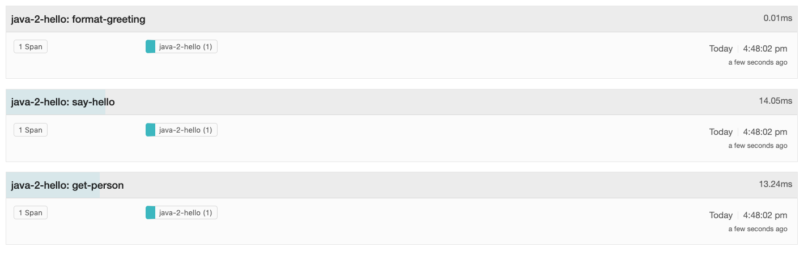
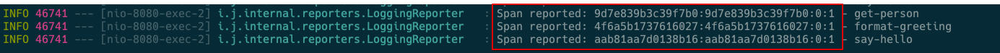
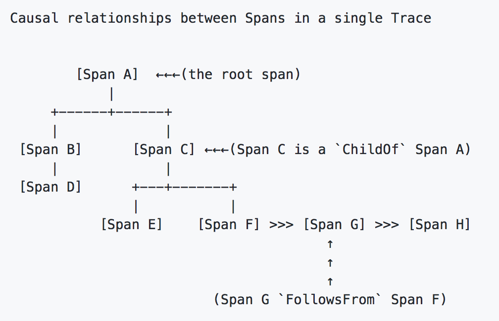
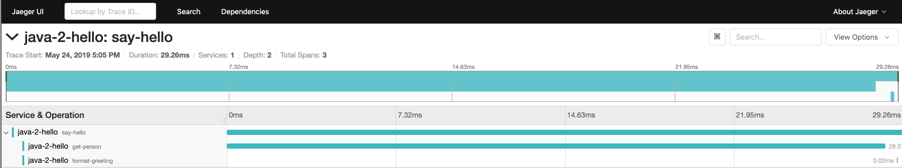

## Exeicise 3 - Tracing Functions and passing context

 - [각 function에 Trace를 추가하기](#step-1--각-function에-Trace를-추가하기)
 - [하나의 Trace에 여러 span을 연계하기](#step-2--하나의-Trace에-여러-span을-연계하기)
 - [동일한 프로세스내에서 context 전파하기(propagate)](#step-3--동일한-프로세스내에서-context-전파하기) 

### Step 1 : 각 function에 Trace를 추가하기
이제 database에 데이터를 읽어오는 "formatting"과 "greeting" 함수에 span을 추가한다. 

```java
private Person getPerson(String name) {
    Span span = tracer.buildSpan("get-person").start();
    try {
        ...
        return new Person(name);
    } finally {
        span.finish();
    }
}
private String formatGreeting(Person person) {
    Span span = tracer.buildSpan("format-greeting").start();
    try {
        ...
        return response;
    } finally {
        span.finish();
    }
}

```
결과 확인를 확인해 보면 3개의 개별 Trace가 생성된다.  



### Step 2 : 하나의 Trace에 여러 span을 연계하기
Spring Boot를 실행한 console에서 각 span을 Reporting 하는 정보를 볼 수 있다. 



이것은 `traceid:span-id:parent-id:flags` 형식으로 표시된다. 
각 로그의 제일 앞부분에 나온느 traceid가 제각각인것을 확인할 수 있다. 이는 각 request 마다의 span을 모아서 연관분석을 하고자 하는 방향과 맞지 않다. OpenTracing에서는 이런 span간의 연관관계를 `span references`라고 하며 `child-of`와 `follow-from`유형으로 span간의 연관 관계를 나타낸다. 

이 두가지 유형은 모두 부모자식 즉 span간의 선후관계를 나타내지만

 - `child-of` : 이전에 일어난 span의 결과에 종속적인 관계  
 - `follow-from` : fire-and-forget, producer-consumer pattern과 같이 언제 처리될지 모르는 관계

)

```java
//asChildOf()를 사용한 span reference 연계
private Person getPerson(String name, Span parent) {
    Span span = tracer
        .buildSpan("get-person")
        .asChildOf(parent)
        .start();
    ...
}
private String formatGreeting(Person person, Span parent) {
    Span span = tracer
        .buildSpan("format-greeting")
        .asChildOf(parent)
        .start();
    ...
}

// sayHello()내에서 아래 함수의 호출부도 변경해야 한다. 
Person person = getPerson(name, span);
String response = formatGreeting(person, span);

```
### Step 3 : 동일한 프로세스내에서 context 전파하기
이제 애플리케이션을 실행하면 Jaeger UI에서 하나의 trace에 각각 span들이 묶여서 보여질 것이다. 




그러나 지금까지의 Approach는 매번 소스코드를 변경해서 처리하도록 해야 하는데 대규모의 애플리케이션에는 적합하지 않은 Approach이다.   
이런 과정을 보통 `in-process context propagation`이라 부르며, 이를 위해서 다양한 언어와 프레임워크에서 지원기능을 제공하고 있다. OpenTracing API에서는 "active span", "scope manager"등이 이에 해당한다. 

이는 서버에서 각각의 Reqeust별로 생성하는 thread 별로 span를 시작해서 `active` span으로 설정하고, remote call등을 할때는 `child-of` span을 생성해서 span간의 stack 구조를 관리한다고 비유적으로 이해할 수 있다. (Stack 구조는 이해를 위한 비유이며 세부 구현은 차이가 있다. p129)  

scope manager에게 span을 activate하면 해당 scope의 상태로 되며, scope을 close하면 stack의 맨위애서 해당 scope을 삭제하고 그 다음에 있는 scope이 active가 된다.

따라서 기존 소스 코드의 signature는 그대로 살리면서 instrument를 구현할 수 있다.

```java
import io.opentracing.Scope;

@GetMapping("/sayHello/{name}")
public String sayHello(@PathVariable String name) {
    Span span = tracer.buildSpan("say-hello").start();
    try (Scope s = tracer.scopeManager().activate(span, false)) {
        ...
    } finally {
        span.finish();
    }
}


private Person getPerson(String name) {
    Span span = tracer.buildSpan("get-person").start();
    try (Scope s = tracer.scopeManager().activate(span, false)) {
        ...
    } finally {
        span.finish();
    }
}
private String formatGreeting(Person person) {
    Span span = tracer.buildSpan("format-greeting").start();
    try (Scope s = tracer.scopeManager().activate(span, false)) {
        ...
    } finally {
        span.finish();
    }
}

```

>exercise3b에서 완전한 코드를 확인할 수 있다. 