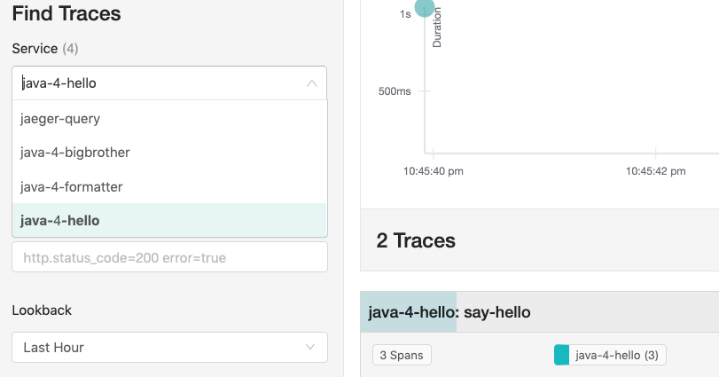
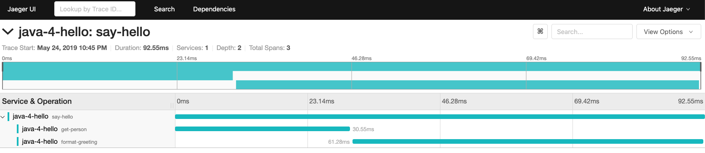
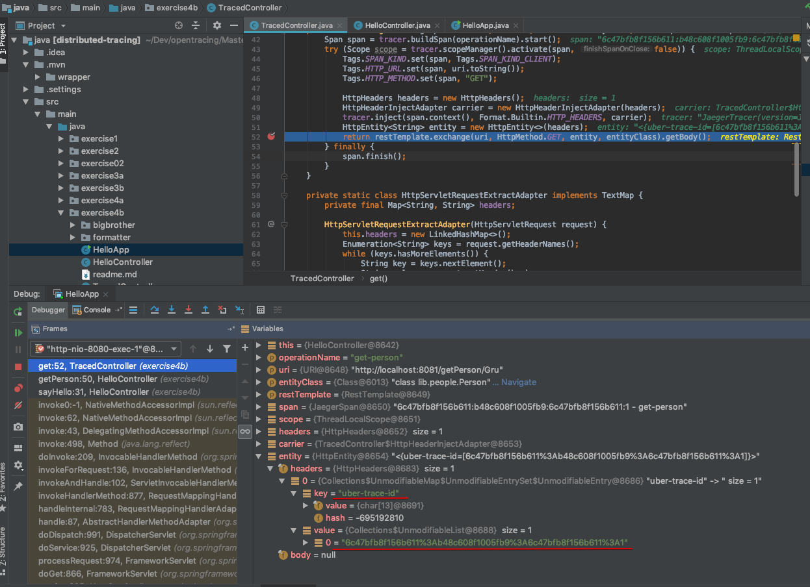

## Exeicise 4 - Tracing RPC Request

기존 Hello Application을 Distributed Tracing을 위해 Microservice 기반 애플리케이션으로 변경한다. 


 - [마이크로서비스간의 트랜젝션 trace하기](#step-1--일체형-애플리케이션-분해하기)
 - [inject와 extract trace point를 이용해 프로세스간에 context 전달하기](#step-2--프로세스간-context-전달하기) 
 - [OpenTracing-recommended tag 적용하기](#step-3--OpenTracing-recommended-tag-적용하기)


 ### Step 1 - 일체형 애플리케이션 분해하기 
기존 애플리케이션의 기능을 분해해서 두개의 Microservice를 만든다. 
 - Big Brother : http 8081 포트를 listen하는 WebApp을 만들고 getPerson 함수로 Path Parameter를 읽어 JSON을 응답
 - Formatter : HTTP 8082 포트를 listen하며, endpoint는 formatGreeting에 파라메터를 받아서 plain text로 응답

```bash
$ curl http://localhost:8081/getPerson/Gru
{"Name":"Gru","Title":"Felonius","Description":"Where are the
minions?"}

$ curl 'http://localhost:8082/formatGreeting?name=Smith&title=Agent'
Hello, Agent Smith!

```
HelloController에는 여전히 getPerson()과 formatGreeting() 메소드가 있으나, HTTP Request로 두개의 마이크로서비스(Big Brother, Formatter)를 스프링의 `RestTemplate`를 이용해서 호출한다. 
```java
@Autowired
private RestTemplate restTemplate;
```


두개의 마이크로서비스(Big Brother와 Formatter)는 각각 Controller class를 가지며, 각각 unique한 tracer를 만들고, /resource/application.properties에 정의되어 있는 "server.port"를 아래와 같이 재정의한다.  

```java
// BBApp
@EnableJpaRepositories("lib.people")
@EntityScan("lib.people")
@SpringBootApplication
public class BBApp {
    @Bean
    public io.opentracing.Tracer initTracer() {
        ...
        return new Configuration("java-4-bigbrother")
            .withSampler(samplerConfig)
            .withReporter(reporterConfig)
            .getTracer();
    }

    public static void main(String[] args) {
        System.setProperty("server.port", "8081");
        SpringApplication.run(BBApp.class, args);
    }
}

// FApp
public class FApp {

    @Bean
    public io.opentracing.Tracer initTracer() {
        ...
        return new Configuration("java-4-formatter").withSampler(samplerConfig).withReporter(reporterConfig).getTracer();
    }

    public static void main(String[] args) {
        System.setProperty("server.port", "8082");
        SpringApplication.run(FApp.class, args);
    }
```
두 Controller는 HelloController와 유사하며 기존의 getPerson()과 formatGreeting()메소드를 구현하며, 새로운 span을 추가한다.  

각 마이크로서비스를 실행하기 위해서 별도의 터미널에서 아래을 실행한다. 

```bash
$ ./mvnw spring-boot:run -Dmain.class=exercise4a.bigbrother.BBApp
$ ./mvnw spring-boot:run -Dmain.class=exercise4a.formatter.FApp

$ ./mvnw spring-boot:run -Dmain.class=exercise4a.HelloApp
```

실행한 결과는 다음과 같다. 




 ### Step 2 - 프로세스간 context 전달하기
위의 그림에서 보는 바와 같이 각각의 TraceID를 가지고 개별로 로그가 쌓이게 된다. 
이를 극복하기 위해서는 프로세스간에 span context를 전파(propagation)할 수 있는 메커니즘이 필요하며, OpenTracing API에서는 Inject(spanContext, format, carrier)와 Extract(format, carrier)를 이용해서 프로세스간에 span context를 전파한다. 

 여기서 format 파라미터는 아래와 3가지 표준 encoding 방식을 중 하나이다. 

 - `TEXT_MAP`:  span contex가 key value pair의 collection으로 encoding됨 
 - `BINARY` :  span context가 byte array로 encoding됨
 - `HTTP_HEADERS`: 키가 HTTP 헤더로 사용되기에 안전해야 한다는 점을 제외하고 TEXT_MAP와 유사함

`carrier`는 사용하는 RPC 프레임워크에 대한 추상화를 제공한다. 예를 들어 TEXT_MAP format의 carrier는 put(key, value) 방식을 통해 trace가 키 값 쌍을 사용할 수 있도록하는 인터페이스이며, Binary format의 carrier는 단순한 ByteBuffer의 인터페이스이다. (참조 p133 & [OpenTracing Tutorial](https://github.com/yurishkuro/opentracing-tutorial/tree/master/java/src/main/java/lesson03))

이 메커니즘을 사용하기 위해서 Hello Application에 `InJect()`을 호출해서 span context를 주입하며, Big Brother와 Formatter에서 `Extract()`를 호출해야 한다. 

본 예제에서는 이 과정을 단순화 하기 위해서 helper base class인 "TraceController"를 사용하고 3개 서비스의 Controller가 이 클래스를 상속해서 구현한다.  

"TraceController"에는 get()과 startServerSpan()이 있다. 

get() 메소드는 HTTP Request를 호출할때 사용되며, `trace.inject`를 통해 trace context header에 주입된다. 
스프링의 "HttpHeaders"를 HttpHeaderInjectAdapter 클래스의 인자로 받으며 OpenTracing의 TEXTMAP 인터페이스를 구현한다. TextMap 인터페이스는 interator()메소드가 있으면 이는 tracer.extract()할때 사용되며, put()는 tracer.inject()할때 사용된다. 

 ```java
protected <T> T get(String operationName, URI uri, Class<T> entityClass, RestTemplate restTemplate) {
        Span span = tracer.buildSpan(operationName).start();
        try (Scope s = tracer.scopeManager().activate(span,false)) {
            HttpHeaders headers = new HttpHeaders();
            HttpHeaderInjectAdapter carrier = new HttpHeaderInjectAdapter(headers);
            tracer.inject(scope.span().context(),
            Format.Builtin.HTTP_HEADERS, carrier);
            HttpEntity<String> entity = new HttpEntity<>(headers);
            return restTemplate.exchange(uri, HttpMethod.GET, entity, entityClass).getBody();
        } finally {
            span.finish();
        }
}


private static class HttpHeaderInjectAdapter implements TextMap {
    private final HttpHeaders headers;

    HttpHeaderInjectAdapter(HttpHeaders headers) {
        this.headers = headers;
    }

    @Override
    public Iterator<Entry<String, String>> iterator() {
        throw new UnsupportedOperationException();
    }

    @Override
    public void put(String key, String value) {
        headers.set(key, value);
    }
}

```

HelloAppController에서 get을 호출해 다른 서비스를 호출할때의 상태를 Debugging으로 확인해 보면 아래와 같이 RestTemplate을 이용해 `HttpEntity`타입으로  key="uber-trace-id"와 value="6c47bfb8f156b611"을 전달하는 것을 알수 있다. 



HTTP 요청을 받는 쪽에서는 startServerSpan()으로 span context를 extract한다. 
HttpServletRequestExtractAdapter는 TexMap 인터페이스를 상속하여 interator()을 구현한다. 

```java
protected Span startServerSpan(String operationName, HttpServletRequest request) {
    HttpServletRequestExtractAdapter carrier = new HttpServletRequestExtractAdapter(request);
    SpanContext parent = tracer.extract(Format.Builtin.HTTP_HEADERS, carrier);
    Span span = tracer.buildSpan(operationName).asChildOf(parent).start();
    Tags.SPAN_KIND.set(span, Tags.SPAN_KIND_SERVER);
    return span;
}

private static class HttpServletRequestExtractAdapter implements TextMap {
    private final Map<String, String> headers;

    HttpServletRequestExtractAdapter(HttpServletRequest request) {
        this.headers = new LinkedHashMap<>();
        Enumeration<String> keys = request.getHeaderNames();
        while (keys.hasMoreElements()) {
            String key = keys.nextElement();
            String value = request.getHeader(key);
            headers.put(key, value);
        }
    }

    @Override
    public Iterator<Entry<String, String>> iterator() {
        return headers.entrySet().iterator();
    }

    @Override
    public void put(String key, String value) {
        throw new UnsupportedOperationException();
    }
}
```
이 예제에서는 단순하게 하기 위해서 모든 http header를 plain map에 복사해서 성능적인 면에서 떨어진다. 아래 링크에 좀더 효율적인 구현체를 활용할 수 있다.   
https://github.com/opentracing-contrib/java-web-servletfilter


 ### Step 3 - OpenTracing-recommended tag 적용하기
 세번째 스텝에서는 OpenTracing에서 권장하는 표준 tag를 적용해 본다. 
 
  - span.kind: RPC Request의 역할을 정의 한다. 주로 client - server, 또는 메세징 시스템에서는 producer - consumer 쌍을 많이 사용한다. 
 - http.url: 요청하는 Request URL을 사용한다. 
 - http.method: http verb, GET 또는 POST 등


```java
import io.opentracing.tag.Tags;

protected <T> T get(String operationName, URI uri, Class<T> entityClass, RestTemplate restTemplate) {
        Span span = tracer.buildSpan(operationName).start();
        try (Scope scope = tracer.scopeManager().activate(span, false)) {
            Tags.SPAN_KIND.set(span, Tags.SPAN_KIND_CLIENT);
            Tags.HTTP_URL.set(span, uri.toString());
            Tags.HTTP_METHOD.set(span, "GET");
           ....
        } finally {
            span.finish();
        }
    }
```
